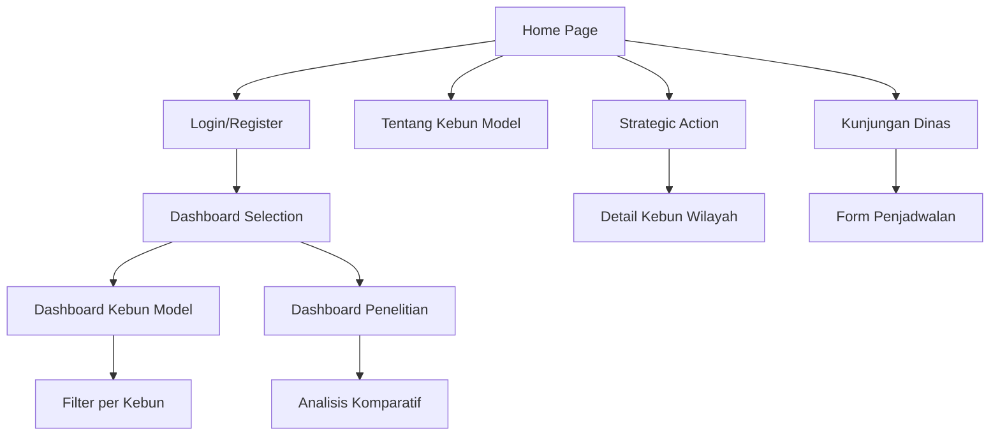

## 1. Product Overview
Portal Informasi dan Monitoring Kinerja Multi-Kebun Model Teh PPTK Gambung adalah sistem web-based untuk mengintegrasikan data produksi dan monitoring kinerja kebun model teh secara real-time. Sistem ini memungkinkan manajer dan teknisi untuk memantau performa berbagai kebun model teh di wilayah Indonesia melalui dashboard interaktif dengan pendekatan rule-based algorithm untuk pengolahan data.

Target pengguna utama adalah manajer kebun, teknisi, dan peneliti di Pusat Penelitian Teh dan Kina (PPTK) Gambung yang membutuhkan akses cepat dan akurat terhadap data produksi dan kinerja kebun model teh.

## 2. Core Features

### 2.1 User Roles
| Role | Registration Method | Core Permissions |
|------|---------------------|------------------|
| Admin | Laravel Breeze registration | Full access - edit data, manage users, upload files |
| Viewer | Laravel Breeze registration | Read-only access - view dashboards and reports |
| Manager | Admin assignment | Extended access - approve reports, schedule visits |

### 2.2 Feature Module
Portal ini terdiri dari halaman-halaman utama berikut:
1. **Halaman Utama**: Hero section, deskripsi sistem, call-to-action ke dashboard, quick links menu utama.
2. **Tentang Kebun Model**: Informasi sejarah, overview kebun model, manfaat, dan peran PPTK.
3. **Strategic Action – Kebun Wilayah**: Navigasi berbasis wilayah dengan sub-halaman untuk setiap kebun.
4. **Kunjungan Dinas**: Timeline kunjungan, form penjadwalan kunjungan baru.
5. **Dashboard Kebun Model**: Dashboard interaktif dengan chart produktivitas, filter per kebun.
6. **Dashboard Bagian Penelitian**: Dashboard khusus penelitian dengan analisis komparatif.
7. **Login/Register**: Autentikasi menggunakan Laravel Breeze.

### 2.3 Page Details
| Page Name | Module Name | Feature description |
|-----------|-------------|---------------------|
| Halaman Utama | Hero section | Tampilkan judul "Selamat Datang di Portal PPTK Gambung", gambar kebun teh, animasi transisi halus |
| Halaman Utama | Deskripsi sistem | Tampilkan penjelasan sistem monitoring real-time, call-to-action button ke dashboard |
| Halaman Utama | Quick links | Navigasi cepat ke menu utama dengan thumbnail dan deskripsi singkat |
| Tentang Kebun Model | Sejarah | Accordion section dengan timeline sejarah kebun model |
| Tentang Kebun Model | Overview | Card layout menjelaskan kebun model yang dikelola PPTK |
| Tentang Kebun Model | Manfaat | List manfaat kebun model dalam format bullet points |
| Strategic Action – Kebun Wilayah | Navigasi Wilayah | Dropdown menu untuk Jawa Barat, Jawa Tengah, Sumatra |
| Strategic Action – Kebun Wilayah | Detail Kebun | Sub-halaman per kebun dengan deskripsi, peta lokasi, foto |
| Strategic Action – Kebun Wilayah | Strategi Produksi | Section dengan bullet points strategi produksi per wilayah |
| Kunjungan Dinas | Timeline Kunjungan | Tabel atau timeline kunjungan dengan mock data |
| Kunjungan Dinas | Form Penjadwalan | Form input untuk menjadwalkan kunjungan baru |
| Dashboard Kebun Model | Filter Kebun | Dropdown/select untuk memilih kebun (Malabar, Ranca Bali, dll) |
| Dashboard Kebun Model | Chart Produktivitas | Line chart produktivitas (kg/ha/th) per bulan dan YTD |
| Dashboard Kebun Model | Chart Persentase RKAP | Bar chart persentase terhadap RKAP per bulan dan YTD |
| Dashboard Kebun Model | Produksi Kering | Card menampilkan total produksi kering (kg) |
| Dashboard Kebun Model | Produksi Basah | Chart produksi basah harian dan rata-rata bulanan |
| Dashboard Kebun Model | Mutu Pucuk | Chart mutu pucuk harian dan rata-rata bulanan |
| Dashboard Kebun Model | Parameter Pendukung | Card pemupukan akar, penyiangan, pemupukan daun |
| Dashboard Kebun Model | Struktur Data | Accordion folder per kebun dengan link file bulanan |
| Dashboard Bagian Penelitian | Analisis Komparatif | Chart perbandingan antar kebun |
| Dashboard Bagian Penelitian | Rule-based Insights | Alert system untuk produktivitas rendah dengan saran |
| Dashboard Bagian Penelitian | Aktivitas Penelitian | Section on-farm/off-farm activities |
| Login/Register | Laravel Breeze | Form autentikasi dengan validasi |

## 3. Core Process

### Admin Flow
1. Login menggunakan Laravel Breeze
2. Akses dashboard admin untuk upload data bulanan
3. Update informasi kebun dan strategi produksi
4. Kelola jadwal kunjungan dinas
5. Monitor semua dashboard dengan data real-time

### Viewer Flow
1. Register/login melalui Laravel Breeze
2. Browse halaman utama untuk informasi umum
3. Navigasi ke strategic action berdasarkan wilayah
4. Akses dashboard untuk monitoring kinerja
5. Download laporan dalam format PDF

### Manager Flow
1. Login dengan role manager
2. Akses dashboard komparatif untuk review performa
3. Approve laporan dan strategi produksi
4. Schedule kunjungan dinas baru
5. Generate insight berbasis rule-based algorithm

## 4. User Interface Design

### 4.1 Design Style
- **Warna Utama**: Hijau #228B22 untuk aksen, #F5F5DC untuk background, putih untuk kebersihan visual
- **Warna Tambahan**: Earth tones (coklat muda, krem) untuk elemen natural
- **Button Style**: Material Design dengan rounded corners, shadow subtle
- **Font**: Roboto dan Open Sans untuk readability, ukuran 14-16px untuk body text
- **Layout**: Card-based design dengan grid system, top navigation horizontal
- **Icon Style**: Material Design icons dengan tema plantation/tea leaf
- **Animasi**: Page transitions smooth, hover effects pada card dan button

### 4.2 Page Design Overview
| Page Name | Module Name | UI Elements |
|-----------|-------------|-------------|
| Halaman Utama | Hero section | Full-width banner dengan gambar kebun teh, overlay gradient hijau, judul besar putih, CTA button hijau |
| Halaman Utama | Quick links | Grid 3x2 card dengan icon Material Design, hover effect scale-up, border-radius 8px |
| Tentang Kebun Model | Accordion | Material Design accordion dengan icon expand/collapse, background putih, border hijau subtle |
| Strategic Action | Dropdown Nav | Material Design dropdown dengan smooth animation, icon location marker |
| Detail Kebun | Content card | Card layout dengan embedded Google Maps, image gallery dengan lightbox |
| Kunjungan Dinas | Timeline | Vertical timeline dengan dot indicator hijau, card untuk setiap kunjungan |
| Dashboard Kebun Model | Chart container | Card-based chart container dengan header hijau, Chart.js integration, filter dropdown |
| Dashboard Kebun Model | Data cards | Material Design card dengan icon, angka besar, label kecil, shadow elevation 2 |
| Login/Register | Form card | Centered card dengan width 400px, input field dengan outline style, primary button hijau |

### 4.3 Responsiveness
- **Desktop-first approach**: Desain utama untuk desktop 1920x1080
- **Mobile adaptive**: Breakpoint 768px untuk tablet, 480px untuk mobile
- **Touch optimization**: Button minimum 44px, swipe-friendly navigation
- **Grid responsive**: 12-column grid yang collapses ke 1-column di mobile
- **Chart responsive**: Chart.js responsive mode aktif untuk semua visualisasi

### 4.4 Additional UI Specifications
- **Search functionality**: Search bar di header dengan autocomplete untuk kebun dan indikator
- **Loading states**: Skeleton screens untuk chart dan data tables
- **Error handling**: Material Design snackbar untuk error messages
- **Accessibility**: ARIA labels untuk semua chart dan interactive elements
- **SEO optimization**: Meta tags untuk "PPTK Gambung", "Monitoring Kebun Teh"