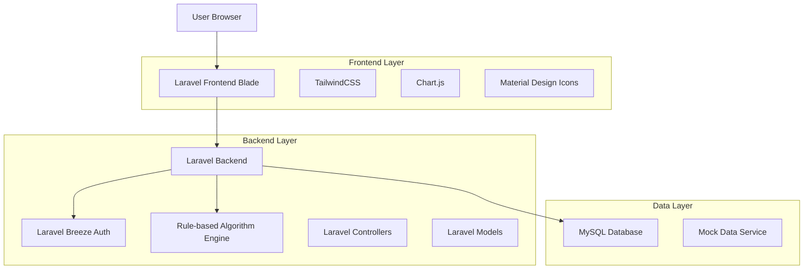
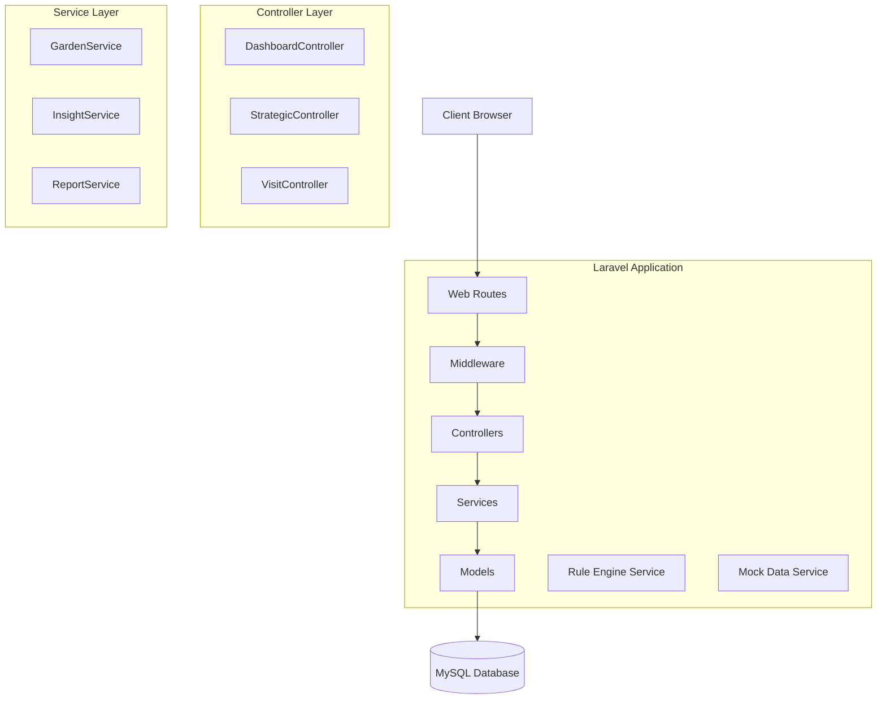
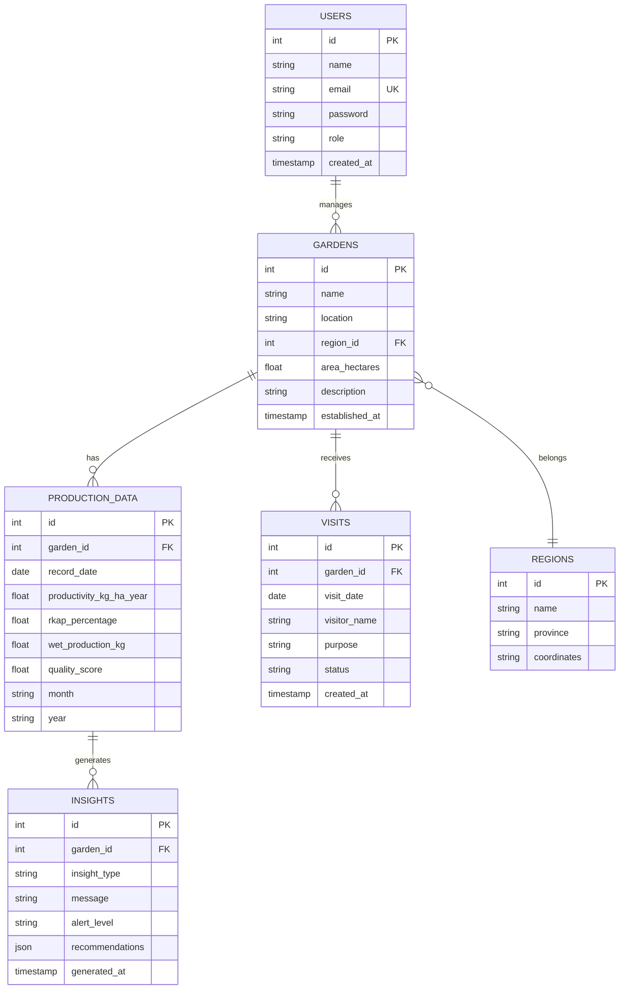

## 1. Architecture Design



## 2. Technology Description

- **Frontend**: Laravel Blade Templates + TailwindCSS@3 + Chart.js
- **Backend**: Laravel@10 dengan Laravel Breeze untuk autentikasi
- **Database**: MySQL@8 untuk data storage
- **Additional Libraries**: 
  - Chart.js untuk visualisasi data
  - Material Design Icons untuk iconography
  - jQuery untuk interactive elements
  - Laravel Debugbar untuk development

## 3. Route Definitions

| Route | Purpose | Controller |
|-------|---------|------------|
| / | Home page, hero section dan quick links | HomeController@index |
| /tentang-kebun-model | Informasi kebun model | AboutController@index |
| /strategic-action | Navigasi wilayah | StrategicController@index |
| /strategic-action/{region} | Detail wilayah | StrategicController@region |
| /strategic-action/{region}/{garden} | Detail kebun | StrategicController@garden |
| /kunjungan-dinas | Daftar kunjungan | VisitController@index |
| /kunjungan-dinas/create | Form penjadwalan | VisitController@create |
| /dashboard/kebun-model | Dashboard monitoring | DashboardController@garden |
| /dashboard/penelitian | Dashboard penelitian | DashboardController@research |
| /login | Login page | Auth\LoginController |
| /register | Register page | Auth\RegisterController |
| /dashboard | User dashboard | DashboardController@user |

## 4. API Definitions

### 4.1 Garden Data API

```
GET /api/gardens/{id}/productivity
```

Request:
| Param Name | Param Type | isRequired | Description |
|------------|------------|-------------|-------------|
| id | integer | true | Garden ID |
| month | string | false | Filter by month (YYYY-MM) |
| year | string | false | Filter by year (YYYY) |

Response:
| Param Name | Param Type | Description |
|------------|-------------|-------------|
| productivity | array | Monthly productivity data (kg/ha/year) |
| rkap_percentage | array | RKAP percentage data |
| wet_production | array | Daily wet production data |
| quality | array | Daily quality metrics |

Example Response:
```json
{
  "productivity": [
    {"month": "January", "value": 1200},
    {"month": "February", "value": 1350}
  ],
  "rkap_percentage": [
    {"month": "January", "value": 95.5},
    {"month": "February", "value": 102.3}
  ]
}
```

### 4.2 Rule-based Insights API

```
POST /api/insights/generate
```

Request:
| Param Name | Param Type | isRequired | Description |
|------------|------------|-------------|-------------|
| garden_id | integer | true | Garden ID |
| metric_type | string | true | Type of metric (productivity/quality/etc) |

Response:
| Param Name | Param Type | Description |
|------------|-------------|-------------|
| insight | string | Generated insight message |
| recommendation | array | List of recommendations |
| alert_level | string | Alert severity (low/medium/high) |

## 5. Server Architecture Diagram



## 6. Data Model

### 6.1 Data Model Definition



### 6.2 Data Definition Language

Users Table:
```sql
CREATE TABLE users (
    id BIGINT UNSIGNED AUTO_INCREMENT PRIMARY KEY,
    name VARCHAR(255) NOT NULL,
    email VARCHAR(255) UNIQUE NOT NULL,
    email_verified_at TIMESTAMP NULL,
    password VARCHAR(255) NOT NULL,
    role ENUM('admin', 'manager', 'viewer') DEFAULT 'viewer',
    remember_token VARCHAR(100) NULL,
    created_at TIMESTAMP DEFAULT CURRENT_TIMESTAMP,
    updated_at TIMESTAMP DEFAULT CURRENT_TIMESTAMP ON UPDATE CURRENT_TIMESTAMP
);
```

Gardens Table:
```sql
CREATE TABLE gardens (
    id BIGINT UNSIGNED AUTO_INCREMENT PRIMARY KEY,
    name VARCHAR(255) NOT NULL,
    location VARCHAR(255) NOT NULL,
    region_id BIGINT UNSIGNED NOT NULL,
    area_hectares DECIMAL(10,2) NOT NULL,
    description TEXT,
    established_at DATE,
    created_at TIMESTAMP DEFAULT CURRENT_TIMESTAMP,
    updated_at TIMESTAMP DEFAULT CURRENT_TIMESTAMP ON UPDATE CURRENT_TIMESTAMP,
    FOREIGN KEY (region_id) REFERENCES regions(id)
);
```

Regions Table:
```sql
CREATE TABLE regions (
    id BIGINT UNSIGNED AUTO_INCREMENT PRIMARY KEY,
    name VARCHAR(255) NOT NULL,
    province VARCHAR(255) NOT NULL,
    coordinates VARCHAR(255),
    created_at TIMESTAMP DEFAULT CURRENT_TIMESTAMP,
    updated_at TIMESTAMP DEFAULT CURRENT_TIMESTAMP ON UPDATE CURRENT_TIMESTAMP
);
```

Production Data Table:
```sql
CREATE TABLE production_data (
    id BIGINT UNSIGNED AUTO_INCREMENT PRIMARY KEY,
    garden_id BIGINT UNSIGNED NOT NULL,
    record_date DATE NOT NULL,
    productivity_kg_ha_year DECIMAL(10,2),
    rkap_percentage DECIMAL(5,2),
    wet_production_kg DECIMAL(10,2),
    quality_score DECIMAL(3,1),
    month VARCHAR(20),
    year VARCHAR(4),
    created_at TIMESTAMP DEFAULT CURRENT_TIMESTAMP,
    updated_at TIMESTAMP DEFAULT CURRENT_TIMESTAMP ON UPDATE CURRENT_TIMESTAMP,
    FOREIGN KEY (garden_id) REFERENCES gardens(id),
    INDEX idx_garden_date (garden_id, record_date),
    INDEX idx_month_year (month, year)
);
```

Visits Table:
```sql
CREATE TABLE visits (
    id BIGINT UNSIGNED AUTO_INCREMENT PRIMARY KEY,
    garden_id BIGINT UNSIGNED NOT NULL,
    visit_date DATE NOT NULL,
    visitor_name VARCHAR(255) NOT NULL,
    purpose TEXT NOT NULL,
    status ENUM('scheduled', 'completed', 'cancelled') DEFAULT 'scheduled',
    created_at TIMESTAMP DEFAULT CURRENT_TIMESTAMP,
    updated_at TIMESTAMP DEFAULT CURRENT_TIMESTAMP ON UPDATE CURRENT_TIMESTAMP,
    FOREIGN KEY (garden_id) REFERENCES gardens(id),
    INDEX idx_visit_date (visit_date)
);
```

Insights Table:
```sql
CREATE TABLE insights (
    id BIGINT UNSIGNED AUTO_INCREMENT PRIMARY KEY,
    garden_id BIGINT UNSIGNED NOT NULL,
    insight_type VARCHAR(100) NOT NULL,
    message TEXT NOT NULL,
    alert_level ENUM('low', 'medium', 'high') NOT NULL,
    recommendations JSON,
    generated_at TIMESTAMP DEFAULT CURRENT_TIMESTAMP,
    FOREIGN KEY (garden_id) REFERENCES gardens(id),
    INDEX idx_garden_insight (garden_id, insight_type),
    INDEX idx_alert_level (alert_level)
);
```

### 6.3 Mock Data Initialization

```sql
-- Insert Regions
INSERT INTO regions (name, province, coordinates) VALUES
('Jawa Barat', 'West Java', '-6.9000,107.6000'),
('Jawa Tengah', 'Central Java', '-7.1500,110.4000'),
('Sumatra', 'South Sumatra', '-4.0000,103.0000');

-- Insert Gardens
INSERT INTO gardens (name, location, region_id, area_hectares, description, established_at) VALUES
('Malabar', 'Bandung', 1, 150.50, 'Kebun model utama di kawasan Malabar', '1985-01-15'),
('Ranca Bali', 'Bandung', 1, 120.75, 'Kebun model dengan sistem irigasi modern', '1990-03-20'),
('Sedep', 'Garut', 1, 95.25, 'Kebun model dengan varietas unggul', '1988-07-10'),
('Kaligua', 'Brebes', 2, 110.00, 'Kebun model di dataran rendah', '1992-05-18'),
('Pagar Alam', 'South Sumatra', 3, 180.30, 'Kebun model terluas di Sumatra', '1983-11-25');

-- Insert Sample Production Data
INSERT INTO production_data (garden_id, record_date, productivity_kg_ha_year, rkap_percentage, wet_production_kg, quality_score, month, year) VALUES
(1, '2024-01-31', 1200.50, 95.50, 4500.75, 8.5, 'January', '2024'),
(1, '2024-02-29', 1350.25, 102.30, 5200.00, 8.7, 'February', '2024'),
(2, '2024-01-31', 1100.75, 88.20, 3800.50, 8.3, 'January', '2024'),
(2, '2024-02-29', 1250.00, 95.80, 4300.25, 8.6, 'February', '2024');
```

## 7. Rule-based Algorithm Implementation

### 7.1 Productivity Analysis Rules
```php
class InsightService {
    public function generateProductivityInsight($gardenId, $currentProductivity) {
        $thresholdLow = 1000; // kg/ha/year
        $thresholdMedium = 1300; // kg/ha/year
        
        if ($currentProductivity < $thresholdLow) {
            return [
                'alert_level' => 'high',
                'message' => 'Produktivitas rendah terdeteksi',
                'recommendations' => [
                    'Tingkatkan dosis pemupukan nitrogen',
                    'Evaluasi sistem drainase',
                    'Lakukan pemangkasan pohon yang tepat'
                ]
            ];
        } elseif ($currentProductivity < $thresholdMedium) {
            return [
                'alert_level' => 'medium',
                'message' => 'Produktivitas menengah, perlu perhatian',
                'recommendations' => [
                    'Pertahankan dosis pemupukan saat ini',
                    'Monitor kondisi cuaca',
                    'Lakukan pemupukan daun rutin'
                ]
            ];
        } else {
            return [
                'alert_level' => 'low',
                'message' => 'Produktivitas optimal',
                'recommendations' => [
                    'Pertahankan praktik baik saat ini',
                    'Dokumentasikan best practices',
                    'Bagikan pengalaman dengan kebun lain'
                ]
            ];
        }
    }
}
```

## 8. Environment Configuration

### 8.1 .env Configuration
```env
APP_NAME="Portal PPTK Gambung"
APP_ENV=local
APP_KEY=base64:your-app-key-here
APP_DEBUG=true
APP_URL=http://localhost:8000

DB_CONNECTION=mysql
DB_HOST=127.0.0.1
DB_PORT=3306
DB_DATABASE=pptk_gambung_portal
DB_USERNAME=root
DB_PASSWORD=

BROADCAST_DRIVER=log
CACHE_DRIVER=file
QUEUE_CONNECTION=sync
SESSION_DRIVER=file
SESSION_LIFETIME=120
```

### 8.2 Package.json Dependencies
```json
{
  "dependencies": {
    "chart.js": "^4.4.0",
    "material-design-icons": "^3.0.1"
  },
  "devDependencies": {
    "axios": "^1.6.0",
    "laravel-vite-plugin": "^1.0.0",
    "vite": "^5.0.0"
  }
}
```